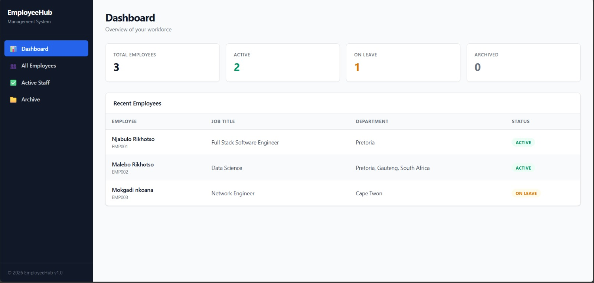
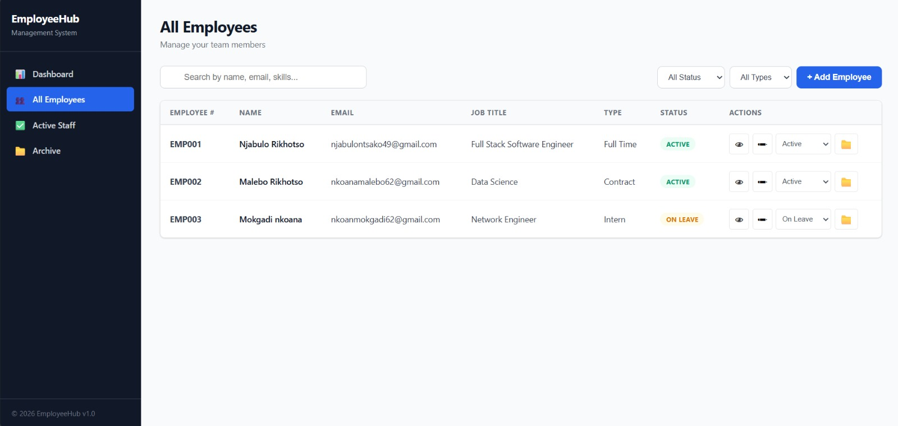
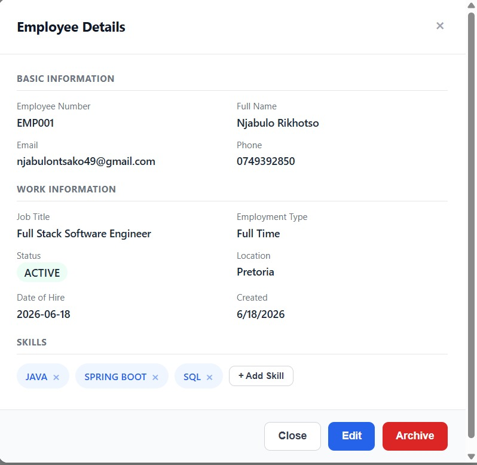
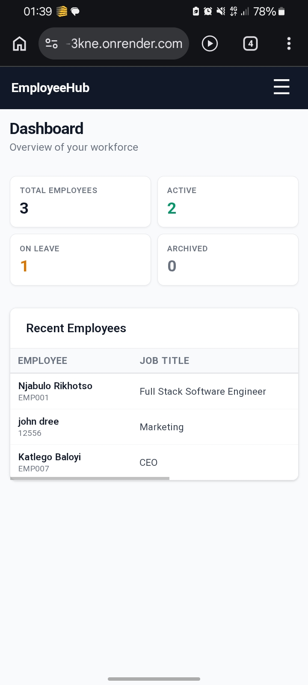

# Employee Management System

A web application to manage employee records. Built with Spring Boot to replace the JEE/GlassFish stack I learned at TUT.

## 🌐 Live Demo

**Live Application:** [https://employee-management-system-3kne.onrender.com](https://employee-management-system-3kne.onrender.com)

> Note: Hosted on Render's free tier. First load may take up to 30 seconds while the server wakes up.

## ☁️ Hosting & Deployment

| Service | Purpose | Plan |
|---------|---------|------|
| Render | Hosts the Spring Boot app | Free |
| Clever Cloud | MySQL database hosting | Free |
| GitHub | Source code & version control | Free |

## What This System Does

A simple employee database where you can:

- Add new employees with their details
- Search for employees by name, email, or skills
- View full employee profiles
- Edit employee information
- Change employee status: Active, On Leave, or Terminated
- Archive old employees instead of deleting them
- Add or remove skills from an employee
- See dashboard stats showing total employees, active employees, employees on leave, and archived employees

## How It's Built: From JEE to Spring Boot

I learned JEE at TUT using GlassFish, EJB, Servlets, and JPA. This project uses Spring Boot, which does the same thing with less code.

| What I Used Before: JEE | What I Used Here: Spring Boot | What It Does |
|---|---|---|
| `@WebServlet` + `doGet()` / `doPost()` | `@RestController` + `@GetMapping` / `@PostMapping` | Handles web requests |
| `@Stateless` EJB | `@Service` class | Business logic |
| `EntityManager` + JPQL queries | `JpaRepository` interface | Database operations |
| `@Entity` class | `@Entity` class | Maps to database table |
| `web.xml` | `application.properties` | Configuration |
| GlassFish Server | Embedded Tomcat | Runs the application |

The biggest difference: In JEE I wrote JPQL queries manually. In Spring Boot, the repository writes SQL for me based on method names like `findByEmail()`.

## Technologies Used

| Layer | Technology |
|---|---|
| Backend | Java 17, Spring Boot 4.1.0 |
| Database | MySQL 9.7 |
| Database Access | Spring Data JPA: Hibernate |
| Frontend | HTML, CSS, JavaScript: no frameworks |
| Build Tool | Maven |
| IDE | IntelliJ IDEA |
| API Testing | Postman |

## Screenshots






## How to Run This Project

### What You Need

- Java 17 or newer
- MySQL Server installed
- IntelliJ IDEA, or any Java IDE

### Steps

1. Download the project

   Click the green **Code** button on GitHub, download the ZIP file, and extract it.

2. Create the database

   Open MySQL Workbench and run:

   ```sql
   CREATE DATABASE employee_management;
   ```

3. Set your database password

   Copy `application.properties.sample`, rename it to `application.properties`, and change `YOUR_PASSWORD_HERE` to your MySQL password.

4. Open in IntelliJ

   Open IntelliJ, click **Open**, and select the project folder. Wait for Maven to download the dependencies.

5. Run the project

   Find `EmployeeManagementSystemApplication.java` and click the green play button. Wait for **Started** to appear in the console.

6. Open in browser

   ```text
   http://localhost:8080
   ```

## API Endpoints: For Testing with Postman

| Method | URL | What It Does |
|---|---|---|
| `GET` | `/api/employees` | Get all employees |
| `GET` | `/api/employees/1` | Get employee with ID 1 |
| `GET` | `/api/employees/search?query=John` | Search for "John" |
| `POST` | `/api/employees` | Add a new employee |
| `PUT` | `/api/employees/1` | Update employee 1 |
| `PATCH` | `/api/employees/1/status?status=on_leave` | Change status |
| `PATCH` | `/api/employees/1/archive` | Archive employee |
| `PATCH` | `/api/employees/1/unarchive` | Restore employee |
| `DELETE` | `/api/employees/1` | Delete permanently: employee must be archived first |
| `PATCH` | `/api/employees/1/skills/add?skill=Java` | Add a skill |
| `PATCH` | `/api/employees/1/skills/remove?skill=Java` | Remove a skill |

## Example: Create Employee

**Method:** `POST`

**URL:**

```text
http://localhost:8080/api/employees
```

**Body:**

```json
{
  "employeeNumber": "EMP001",
  "firstName": "John",
  "lastName": "Doe",
  "email": "john@company.com",
  "phoneNumber": "0821234567",
  "jobTitle": "Developer",
  "employmentType": "full_time",
  "employmentStatus": "active",
  "location": "Pretoria",
  "skills": "Java, Spring, SQL",
  "dateOfHire": "2024-01-15"
}
```

## Author

**Njabulo Rikhotso** – Built as a personal project to practice Spring Boot after learning JEE at TUT.

GitHub: https://github.com/Njabulo25

Repository: https://github.com/Njabulo25/employee-management-system

Live Application: https://employee-management-system-3kne.onrender.com
